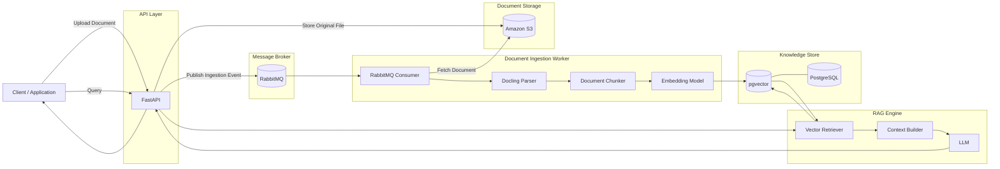
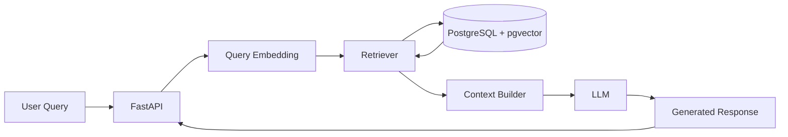

# RAG Pipeline

A production-oriented **Retrieval-Augmented Generation (RAG) Pipeline** designed for asynchronous document ingestion, structured document parsing, vector storage, semantic retrieval, and LLM-based response generation.

The architecture uses **Amazon S3**, **RabbitMQ**, **Docling**, **PostgreSQL with pgvector**, and **FastAPI**.

---

## Architecture



---

# Core Workflow

The system has two major pipelines:

1. **Document Ingestion Pipeline**
2. **RAG Query Pipeline**

---

# 1. Document Ingestion Pipeline

```text
Document Upload
      │
      ▼
   FastAPI
      │
      ├──────────────► Amazon S3
      │                  │
      │            Original Document
      │
      ▼
 RabbitMQ Event
      │
      ▼
 Ingestion Worker
      │
      ▼
    Docling
      │
      ▼
Structured Document
      │
      ▼
   Chunking
      │
      ▼
Embedding Generation
      │
      ▼
PostgreSQL + pgvector
```

### Step 1 — Document Upload

The client uploads a document through the FastAPI service.

Example:

```http
POST /documents
```

The API is responsible for:

* validating the document
* generating document metadata
* uploading the original document to S3
* publishing an ingestion event to RabbitMQ

The API does **not** perform heavy document processing synchronously.

---

## Step 2 — Store Original Document in S3

The uploaded file is stored in Amazon S3.

Example structure:

```text
bucket/

└── tenants/
    └── {tenant_id}/
        └── documents/
            └── {document_id}/
                └── original.pdf
```

S3 acts as the source of truth for original files.

PostgreSQL stores references such as:

```text
document_id
tenant_id
file_name
s3_key
content_type
status
created_at
```

---

# 3. RabbitMQ Event

After the document is successfully stored in S3, FastAPI publishes an ingestion message.

Example:

```json
{
  "event": "document.uploaded",
  "document_id": "uuid",
  "tenant_id": "uuid",
  "s3_key": "tenants/.../original.pdf"
}
```

RabbitMQ decouples the upload API from the document processing pipeline.

```text
FastAPI
   │
   ▼
RabbitMQ
   │
   ▼
Document Worker
```

This allows expensive parsing and embedding operations to run asynchronously.

---

# 4. Document Processing Worker

A worker consumes messages from RabbitMQ.

Its responsibilities are:

```text
Receive Event
     │
     ▼
Download from S3
     │
     ▼
Parse with Docling
     │
     ▼
Chunk Content
     │
     ▼
Generate Embeddings
     │
     ▼
Store in pgvector
```

The worker updates the document processing status during this lifecycle.

Example statuses:

```text
UPLOADED
PROCESSING
COMPLETED
FAILED
```

---

# 5. Docling

**Docling** is responsible for converting documents into structured content.

Instead of treating a document as raw text, Docling helps preserve document structure.

Typical elements include:

```text
Document
│
├── Title
├── Headings
├── Paragraphs
├── Tables
├── Lists
└── Sections
```

Pipeline:

```text
PDF / DOCX / Document
          │
          ▼
       Docling
          │
          ▼
Structured Representation
          │
          ▼
        Chunker
```

This provides better chunks than basic text extraction.

---

# 6. Chunking

The parsed document is divided into retrieval-friendly chunks.

Each chunk should retain metadata connecting it to its original document.

Example:

```json
{
  "document_id": "doc_123",
  "tenant_id": "tenant_1",
  "chunk_index": 12,
  "content": "Extracted document content...",
  "section": "Technical Requirements",
  "page": 8
}
```

This metadata enables:

* source tracking
* tenant isolation
* filtering
* citations
* document-level retrieval

---

# 7. Embedding Generation

Each chunk is converted into a vector representation.

```text
Chunk

"System must support OAuth authentication"

             │
             ▼

      Embedding Model

             │
             ▼

[0.021, -0.142, 0.82, ...]
```

The resulting embedding is stored alongside the chunk.

---

# 8. PostgreSQL + pgvector

PostgreSQL serves two purposes:

```text
PostgreSQL
│
├── Application / Document Metadata
│
└── Vector Storage
        │
        └── pgvector
```

A simplified schema could look like:

```sql
documents
---------
id
tenant_id
file_name
s3_key
status
created_at
updated_at
```

And:

```sql
document_chunks
---------------
id
document_id
tenant_id
content
metadata
embedding
created_at
```

Example vector column:

```sql
embedding vector(768)
```

The actual dimension depends on the embedding model.

---

# RAG Query Pipeline

The second part of the system handles user queries.



---

# Query Processing

When a user sends:

```text
"What are the authentication requirements?"
```

the pipeline performs:

```text
User Query
    │
    ▼
Query Embedding
    │
    ▼
pgvector Similarity Search
    │
    ▼
Top-K Relevant Chunks
    │
    ▼
Context Builder
    │
    ▼
LLM
    │
    ▼
Generated Answer
```

---

# Vector Retrieval

The query is converted into an embedding using the same embedding model used during ingestion.

```text
Query
  │
  ▼
Embedding Model
  │
  ▼
Query Vector
  │
  ▼
pgvector
```

pgvector performs similarity search against stored document chunks.

The search should also apply tenant filtering.

Conceptually:

```sql
SELECT
    id,
    document_id,
    content,
    metadata
FROM document_chunks
WHERE tenant_id = :tenant_id
ORDER BY embedding <=> :query_embedding
LIMIT :top_k;
```

This prevents data from one tenant from being retrieved for another tenant.

---

# Context Builder

Retrieved chunks are combined into structured context.

Example:

```text
SYSTEM INSTRUCTION

Answer using the provided context.

CONTEXT

[Document: TRD.pdf]
[Section: Authentication]

The system uses OAuth 2.0...

---

[Document: Architecture.pdf]

Authentication requests pass through...

USER QUERY

What authentication mechanism does the system use?
```

The resulting prompt is passed to the configured LLM.

---

# Project Structure

```text
rag-platform/
│
├── apps/
│   ├── api/
│   │   ├── main.py
│   │   ├── dependencies.py
│   │   │
│   │   ├── middleware/
│   │   │   ├── auth.py
│   │   │   ├── request_id.py
│   │   │   └── rate_limit.py
│   │   │
│   │   └── routes/
│   │       ├── documents.py
│   │       ├── chat.py
│   │       └── health.py
│   │
│   └── worker/
│       ├── main.py
│       ├── consumer.py
│       │
│       └── handlers/
│           ├── process_document.py
│           ├── reindex_document.py
│           └── delete_document.py
│
│
├── src/
│   │
│   ├── documents/
│   │   ├── models.py
│   │   ├── schemas.py
│   │   ├── repository.py
│   │   └── service.py
│   │
│   ├── ingestion/
│   │   ├── models.py
│   │   ├── parser.py
│   │   ├── chunker.py
│   │   └── service.py
│   │
│   ├── indexing/
│   │   ├── models.py
│   │   ├── embedder.py
│   │   ├── indexer.py
│   │   └── service.py
│   │
│   ├── retrieval/
│   │   ├── models.py
│   │   ├── service.py
│   │   │
│   │   ├── dense.py
│   │   ├── sparse.py
│   │   ├── fusion.py
│   │   └── reranker.py
│   │
│   ├── generation/
│   │   ├── models.py
│   │   ├── context_builder.py
│   │   ├── prompts.py
│   │   ├── llm.py
│   │   └── service.py
│   │
│   └── shared/
│       ├── config.py
│       ├── exceptions.py
│       ├── logging.py
│       └── constants.py
│
│
├── infrastructure/
│   │
│   ├── postgres/
│   │   ├── connection.py
│   │   ├── session.py
│   │   │
│   │   ├── models/
│   │   │   ├── document.py
│   │   │   └── chunk.py
│   │   │
│   │   └── repositories/
│   │       ├── document_repository.py
│   │       └── chunk_repository.py
│   │
│   ├── vector/
│   │   └── pgvector_store.py
│   │
│   ├── search/
│   │   └── postgres_fts.py
│   │
│   ├── rabbitmq/
│   │   ├── connection.py
│   │   ├── publisher.py
│   │   ├── consumer.py
│   │   ├── messages.py
│   │   └── topology.py
│   │
│   ├── redis/
│   │   ├── connection.py
│   │   ├── cache.py
│   │   ├── locks.py
│   │   └── rate_limiter.py
│   │
│   ├── parsing/
│   │   └── docling_parser.py
│   │
│   ├── storage/
│   │   ├── base.py
│   │   ├── s3.py
│   │   └── local.py
│   │
│   └── ai/
│       ├── embedding_provider.py
│       ├── reranker_provider.py
│       └── llm_provider.py
│
│
├── migrations/
│   ├── versions/
│   └── env.py
│
├── tests/
│   ├── unit/
│   │   ├── ingestion/
│   │   ├── indexing/
│   │   ├── retrieval/
│   │   └── generation/
│   │
│   ├── integration/
│   │   ├── postgres/
│   │   ├── pgvector/
│   │   ├── rabbitmq/
│   │   └── redis/
│   │
│   └── e2e/
│       ├── test_document_pipeline.py
│       └── test_rag_query.py
│
├── scripts/
│   ├── create_indexes.py
│   └── seed.py
│
├── docker/
│   ├── api.Dockerfile
│   └── worker.Dockerfile
│
├── .env.example
├── alembic.ini
├── docker-compose.yml
├── pyproject.toml
├── Makefile
└── README.md
```

---

# Component Responsibilities

| Component       | Responsibility                    |
| --------------- | --------------------------------- |
| FastAPI         | API and orchestration             |
| Amazon S3       | Original document storage         |
| RabbitMQ        | Asynchronous ingestion messaging  |
| Docling         | Document parsing and extraction   |
| Chunker         | Split structured content          |
| Embedding Model | Convert chunks/query into vectors |
| PostgreSQL      | Metadata and persistence          |
| pgvector        | Vector similarity search          |
| Retriever       | Retrieve relevant chunks          |
| Context Builder | Build LLM context                 |
| LLM             | Generate grounded responses       |

---

# API Design

## Upload Document

```http
POST /documents
```

Flow:

```text
Upload
  ↓
S3
  ↓
Create DB record
  ↓
RabbitMQ
  ↓
Return document_id
```

Example response:

```json
{
  "document_id": "uuid",
  "status": "UPLOADED"
}
```

---

## Get Document Status

```http
GET /documents/{document_id}
```

Example:

```json
{
  "document_id": "uuid",
  "file_name": "TRD.pdf",
  "status": "COMPLETED"
}
```

---

## Query RAG

```http
POST /rag/query
```

Example request:

```json
{
  "query": "What are the main technical requirements?"
}
```

Example response:

```json
{
  "answer": "The primary technical requirements are...",
  "sources": [
    {
      "document_id": "uuid",
      "section": "Technical Requirements",
      "page": 7
    }
  ]
}
```

---

# End-to-End Architecture

```text
                         DOCUMENT INGESTION

                              Client
                                │
                                ▼
                            FastAPI
                           /       \
                          /         \
                         ▼           ▼
                       S3         RabbitMQ
                                    │
                                    ▼
                              Ingestion Worker
                                    │
                                    ▼
                                 Docling
                                    │
                                    ▼
                                 Chunker
                                    │
                                    ▼
                              Embedding Model
                                    │
                                    ▼
                         PostgreSQL + pgvector


                              RAG QUERY

                                User
                                 │
                                 ▼
                              FastAPI
                                 │
                                 ▼
                         Query Embedding
                                 │
                                 ▼
                     PostgreSQL + pgvector
                                 │
                                 ▼
                             Retriever
                                 │
                                 ▼
                         Context Builder
                                 │
                                 ▼
                                LLM
                                 │
                                 ▼
                              Response
```

---

# Why This Architecture?

### S3

Large binary documents should not be stored directly in PostgreSQL.

S3 provides scalable object storage while PostgreSQL only maintains document metadata and references.

### RabbitMQ

Document parsing and embedding can be computationally expensive.

RabbitMQ separates:

```text
Request Processing

from

Document Processing
```

This keeps the API responsive and allows workers to scale independently.

### Docling

Docling provides structured document extraction and is better suited to complex documents containing sections, tables, lists, and layouts than basic text extraction.

### PostgreSQL + pgvector

Using PostgreSQL and pgvector allows the system to keep relational metadata and vector embeddings in the same persistence layer.

This simplifies:

* tenant filtering
* document filtering
* metadata joins
* vector retrieval
* transactional operations

---

# Final Architecture Summary

```text
                    ┌─────────────────┐
                    │     FastAPI     │
                    └───────┬─────────┘
                            │
              ┌─────────────┴──────────────┐
              │                            │
              ▼                            ▼
        ┌───────────┐                ┌───────────┐
        │    S3     │                │ RabbitMQ  │
        └───────────┘                └─────┬─────┘
                                          │
                                          ▼
                                    ┌───────────┐
                                    │  Worker   │
                                    └─────┬─────┘
                                          │
                                          ▼
                                    ┌───────────┐
                                    │  Docling  │
                                    └─────┬─────┘
                                          │
                                          ▼
                                    ┌───────────┐
                                    │ Chunking  │
                                    └─────┬─────┘
                                          │
                                          ▼
                                    ┌───────────┐
                                    │Embedding  │
                                    └─────┬─────┘
                                          │
                                          ▼
                              ┌───────────────────────┐
                              │ PostgreSQL + pgvector │
                              └───────────┬───────────┘
                                          │
                                          ▼
                                      Retriever
                                          │
                                          ▼
                                   Context Builder
                                          │
                                          ▼
                                         LLM
```

The architecture cleanly separates **file storage, asynchronous processing, document understanding, vector storage, retrieval, and generation**, allowing each layer to scale independently.
